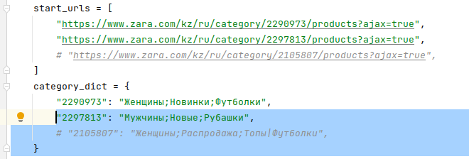

Тестовое задание парсинг интернет магазина ZARA


1.Установите зависимости
```bash
python -m pip install -r requirements.txt
```
2.Перейдите в каталог zara и запустите создание отчета
```bash
cd zara
scrapy crawl zara_final -O 1.xlsx
```
Отчет будет сохранен в формате xlsx
Парсинг сайта осуществлялся с помощью фреймворка Selenium<br>
Путем исследования элементов страницы были определены категории, ссылки на них 




Для определения поля is_active используется библиотека selenium, т.к. scrapy его не вычисляет
